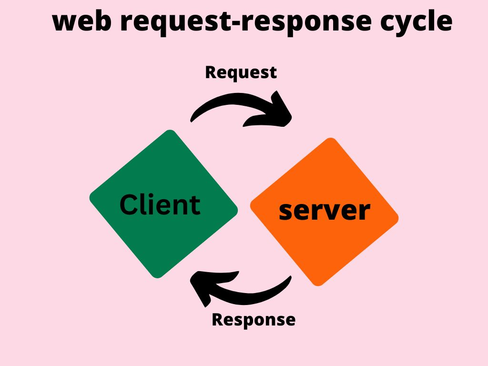
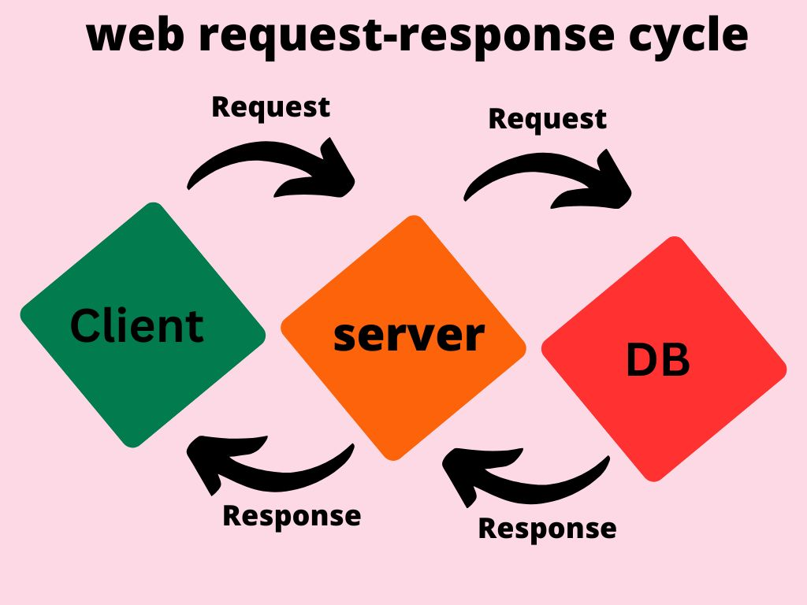

# Movies-Library

## Table of Contents

- [`Project Name - Project Version`](#project-name---project-version)  
- [`WRRC`](#wrrc) 
- [`Overview`](#overview) 
- [`Getting Started`](#getting-started) 
- [`Project Features`](#project-features)

## Project Name - Project Version

Movies-Library - version 3  
**Author Name**: Anas Abed Alhameed Alsallak

## WRRC

version (1):

version (2):

.jpg)

version (3):

## Overview

A movie app that can check the latest movies based on categories.
The 2nd version of the app sends get requests to a 3rd party API and displays the returned data.
The 3rd version of the app uses an sql database to add and get data from it.

## Getting Started

1. Use "git clone ssh" command on your terminal to copy this repositry on your local machine.
2. Install the required packages for this app using : npm install .
3. Setup your database environment, on terminal :
    - Start postgerSQL server using : sqlstart.
    - Create a DB using : createdb "Movies-Library".
    - Run the command to create a table in the DB on new terminal tab in github repo branch directory : psql -d Movies-Library -f schema.sql.
    - Stop postgerSQL server using : sqlstop.

4. Run the server on your terminal using the command: npm start and quit  using Ctrl+c .
5. Navigate to the desired endpoint on your browser using the url : <https://localhost:3000/endPoint_name>.
6. Available endpoints are : / => home,favorite,trending,search,top_rated,top_upcoming,get_movies.
7. To use download Thunder Client extension to your vs code app, add a new request, select the POST method and the url for adding movies : <http://localhost:3000/add_moviey>, add the movie info (title,release_date,poster_path,overview) in json format in the body then hit the Send button.

## Project Features

Version (1): This app is used to get the data of the movie stored in the database when it requestedm view it in a formatted way and dose a basic error handling.

The 2nd version of the app sends get requests to the movie DB API specified by the API key and displays the returned data in a formated way in the browser from different routes.

The 3rd version of the app uses an sql database to add and get data from it.
